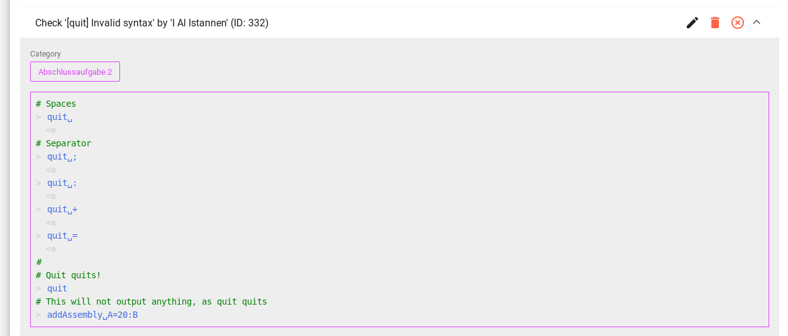
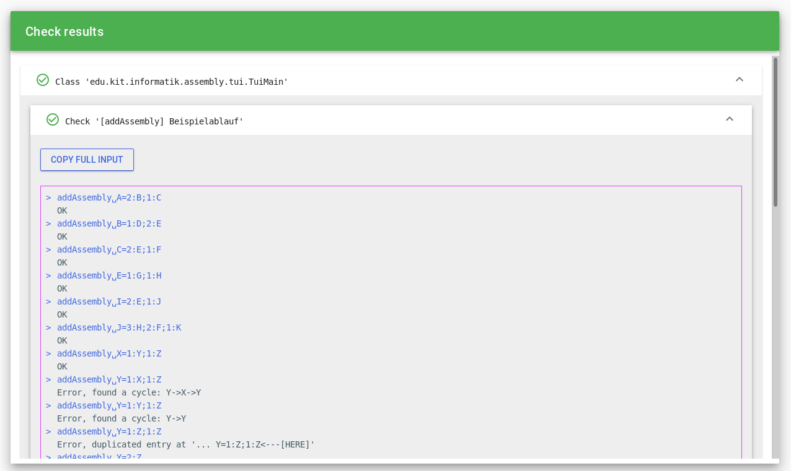

[](https://ci.ialistannen.de/job/SimpleCodeTester/)

## About

This project was created to automatically allow testing programming submissions against a set of tests.
It accepts new checks from anybody, allowing students to collaborate and crowd-source a solid test suit (that is the goal, anyways ;) to collectively ensure their programs are not missing some edge cases.

## Features

* Create and manage Users

* **Input-Output checks:**  
  Allows you to write some example interaction containing expected input, output and optionally comments.
  Each submission is then fed this input and its output is validated.
  Output matching does not only accept literals, but there are some predefined matchers for errors and you can also supply regular expressions.
  As these checks can not be malicious, checks do not need to be approved but can be directly submitted and run.  
  The format is quite simple:
  ```bash
  # Spaces
  > quit 
  <e
  # Separator
  > quit ;
  <e
  > quit :
  <e
  > quit +
  <e
  > quit =
  <e
  #
  # Quit quits!
  > quit
  # This will not output anything, as quit quits
  > addAssembly A=20:B
  ```

* Check uploading is a public action that anybody with an account can do

* Everybody with an account can submit their own code (as source code, files or a zip)

* Viewing and editing checks

* Additionally each check has a *Category* assigned (like the exercise it belongs to) and you can choose the category to run your code against.

## Technology stack

* Spring Boot REST backend
* H2 as a simple flat-file persistent data storage
* Vue.js frontend
* Java tools api to compile the submitted code in memory

# Short overview over the project structure

## Layout in the repository
The repository has three submodules, all managed in the same git repository:

* `SimpleCodeTester-Backend`: The backend spring server
* `simplecodetester-frontend`: The vue frontend
* `SimpleCodeTester-Lib`: The library that powers the code introspection features of the backend

## How a code check request is processed

1. The server verifies the JWT token of the client is valid
2. (if applicable) The server decodes the user submitted zip and extracts all java files
3. The server fetches all checks to run and passes them, together with the source code, over to the library
4. The library spins up a new Slave VM and tells the slave the port number it should connect to
5. The slave is up and has finished basic initialization, connects to the passed port and sends a ready message
6. The library detects that message and sends over the task. This includes all checks to run (either their source code or input/output) and the user submitted code
7. The slave compiles the checks and user code in-memory using the java tools API  
    a. If the compilation fails the client sends a message to the server and kills itself
8. If the compilation was successful the slave runs all checks and reports the results as they are produced. This allows feedback even if the slave exceeds the allotted time and needs to be killed.
9. The library passes the check result back to the server, which sends a response to the client

If the slave does not answer within the timeout (30s by default) it will be forcibly killed. This is possible because the slave sent its PID in the "ready" message.

# Building
1. Install `maven` and a JDK (open/oracle, version *11 or newer*)
2. Install `yarn`
3. Go to the root of the repo and run `mvn clean verify`  
  This will build the spring server and the needed library. Both files, the
  `SimpleCodeTester-Backend/target/SimpleCodeTester.jar` and the 
  `SimpleCodeTester-Lib/target/SimpleCodeTester-Lib.jar` need to deployed.
4. Adjust the needed settings in the backend:
    1. The `runner.classpath` should point to the lib jar you generated and copied above
    2. The `cors.allowedOrigins` should be your domain name(s). It is used in CORS headers.
5. Adjust the needed settings in the frontend:
    1. Change the base url in the `simplecodetester-frontend/src/main.ts` file to point to wherever the backend is listening.
6. Go to the `simplecodetester-frontend` directory and run `yarn serve` to start a development server.
  If you want to deploy it, run `yarn build` and let your webserver serve the created `dist` folder.
# Todos
### Server
* [x] Figure out a nicer way to handle IO/normal checks in the server API
* [ ] Manually create a nice schema and do not rely on JPA+Hibernate being nice
  * [ ] Add `flyway` or a similar technology to allow seamless database schema upgrades
### Frontend
* [ ] Refactor list components to a common CRUD component, if possible
* [ ] Add editing functionality for category names

### General
* [ ] A lot more unit tests and a few integration tests

# Screenshots



