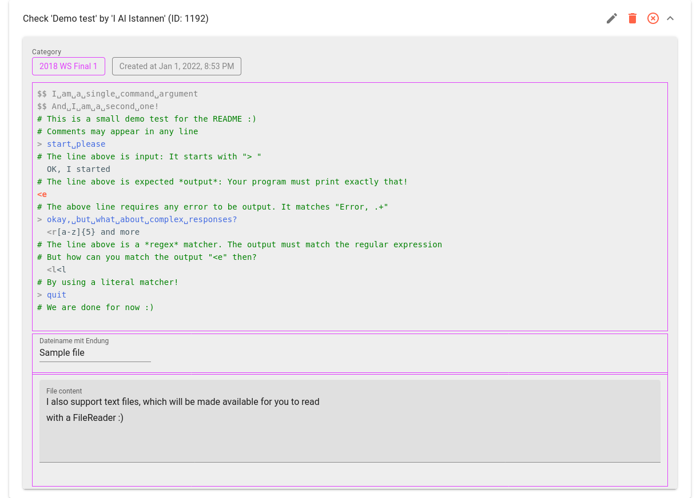
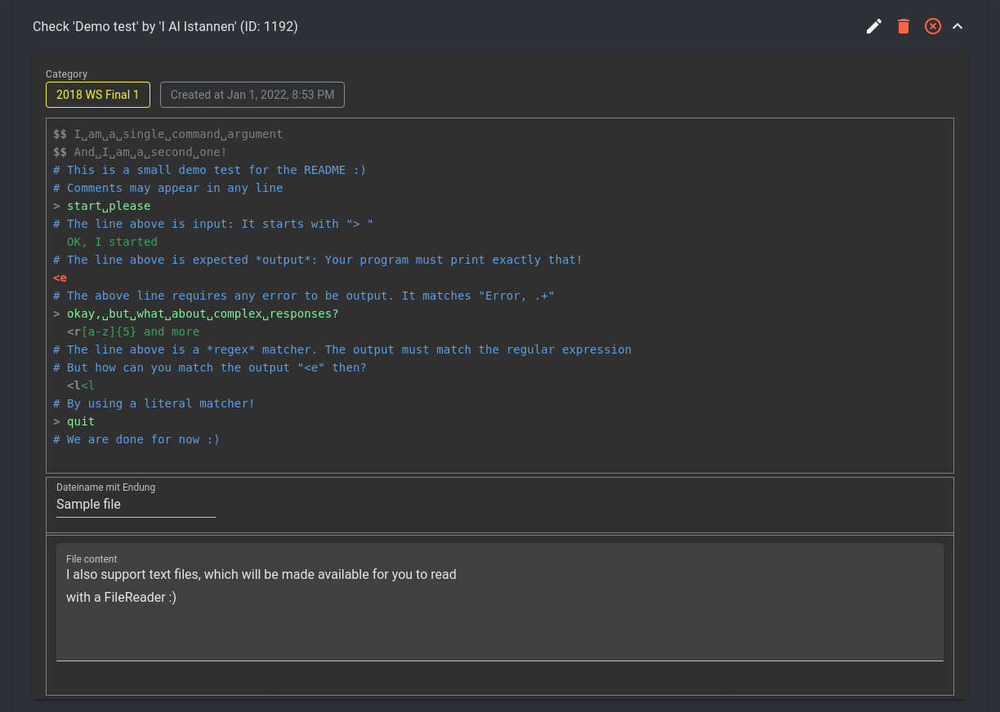
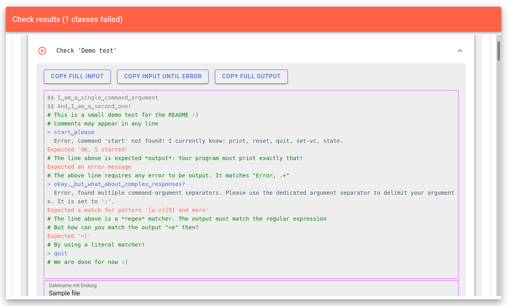

  
  <h1>SimpleCodeTester</h1>

The final exam in some courses is a programming exercise where students create
their own programs. Many people are just starting out with programming (and we
are only human), so *actually testing the code* is extremely paramount.

Sadly, most traditional tools, like JUnit, are hard to use for newcomers, do not
allow easy sharing of test cases and are time consuming to write.
**SimpleCodeTester** is a website that solves this problem:  
Everybody can create checks verifying program output in a simple and intuitive
format. The editor for this supports syntax highlighting to make it a bit more
enjoyable :)

Finally, users can test their code against all submitted tests.
Everybody is free to participate and create tests - everybody will benefit from
them instant they are submitted.

Great care was taken to ensure the online runtime environment is secure (it is
run with a restrictive security manager and each submission is sandboxed in its
own Docker container, without any capabilities or network/disk access). We also
conciously decided, that no user submissions should ever be stored - your code
is received, passed to the sandbox via stdin, fully compiled in-memory and the
last traces of it die with the result response. Feel free to have a look at how
it is implemented though!

# Screenshots
The following is a submitted check

----

And we also have a dark theme!

----

If you submit your code, it will automatically be tested against all checks.
Here is our demo test from earlier, all grown up and failing! In such a case,
we try to match the output your program produced with the expected output and
provide useful error messages.

----

The logo was artfully crafted by
[@libaurea](https://github.com/libaurea/codetester-logo) :tada:
